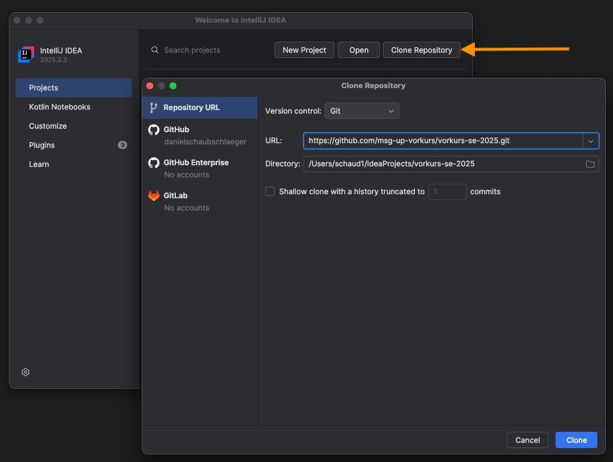
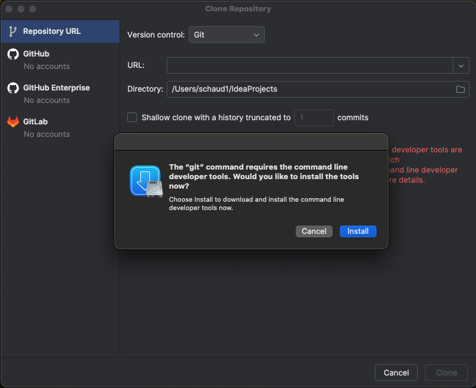
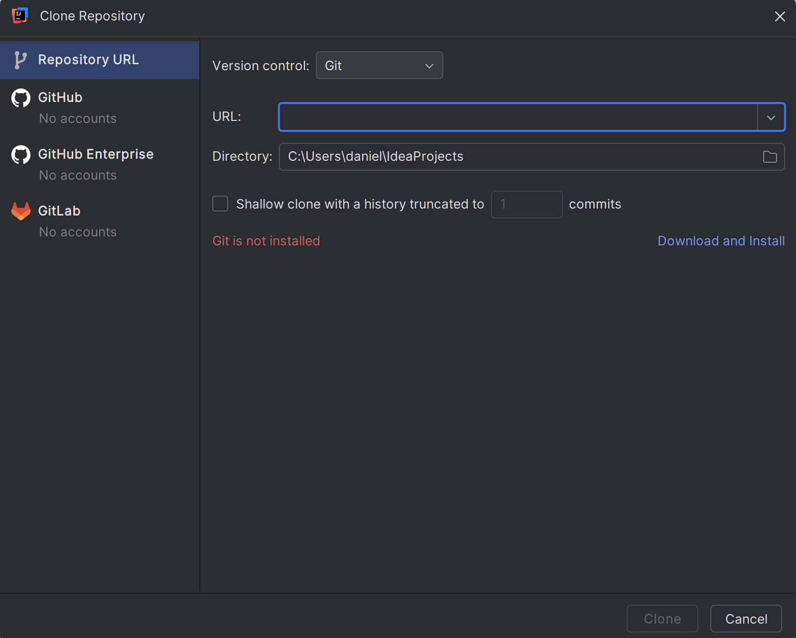
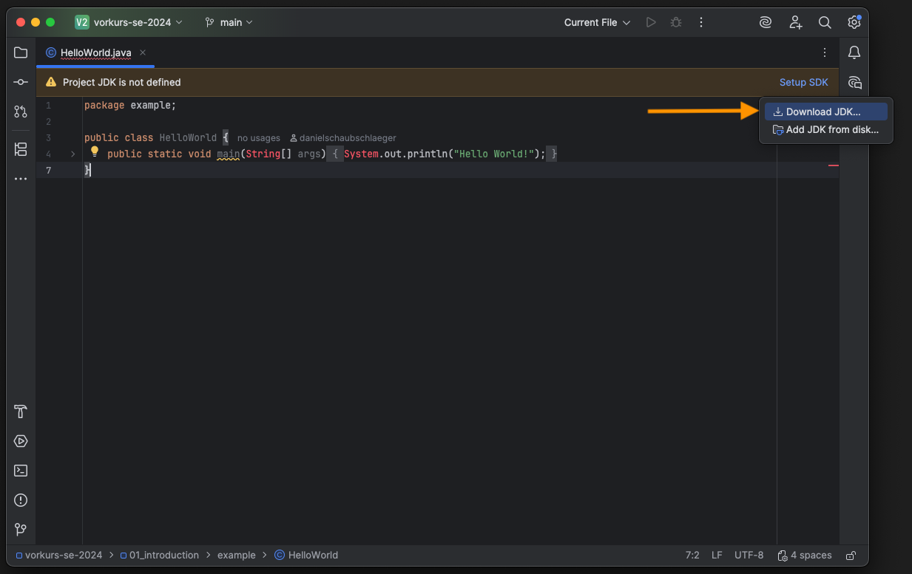
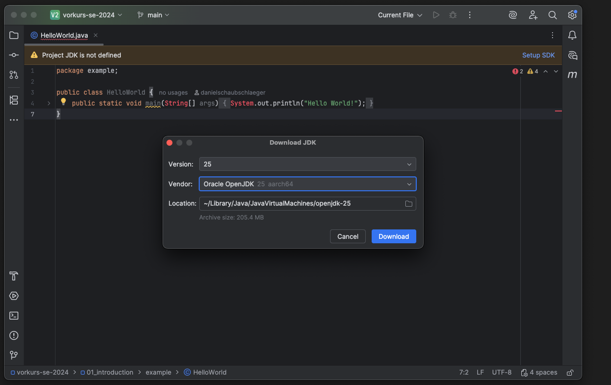
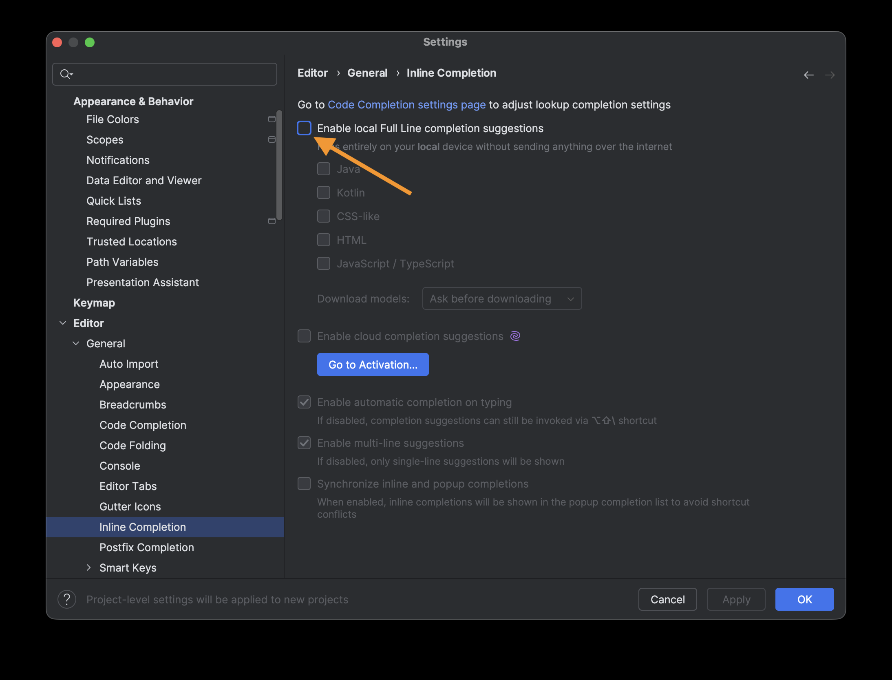

# Installation der Entwicklungsumgebung

Für die Teilnahme am Kurs ist eine funktionierende Entwicklungsumgebung auf dem eigenen Rechner notwendig.

Für die Entwicklung benutzen wir IntelliJ IDEA in der (kostenlosen) Community Edition. Die Übungsaufgaben werden euch über git zum Download bereit gestellt.

## IntellJ IDEA Download Links
* Windows: https://download.jetbrains.com/idea/ideaIC-2025.2.3.exe
* macOS (Intel): https://download.jetbrains.com/idea/ideaIC-2025.2.3.dmg
* macOS (Apple Silicon): https://download.jetbrains.com/idea/ideaIC-2025.2.3-aarch64.dmg
* Linux: https://download.jetbrains.com/idea/ideaIC-2025.2.3.tar.gz

## Vorkurs Repository & git
Um die Übungsaufgaben herunterzuladen, im IntelliJ-Startbildschirm auf "Clone Repository" klicken.

Fügt unter "URL" nun die Adresse des Übungsrepository ein: **https://github.com/msg-up-vorkurs/vorkurs-se-2025.git**

Damit die Aufgaben heruntergeladen werden können, wird mit git ein separates Programm benötigt. git kann direkt über IntelliJ installiert werden:

### macOS
Git wird mit den command-line-tools installiert 

### Windows
Mit Klick auf "Download and install" wird git automatisch auf euren Rechner heruntergeladen und installiert.

Alternativ:
* Windows: https://git-scm.com/downloads/win
* macOS: `xcode-select --install`
* Debian/Ubuntu: `apt-get install git`

## JDK-Download

Für die Ausführung des 'Hello World!' Programms, muss noch ein JDK geladen werden.
Dies kann in IntelliJ direkt mit einem Klick auf 'Setup SDK' und 'Download JDK' geladen werden.

## AI Code Completion

Damit Sie die Programmiergrundlagen auch selbstständig erlernen und auch wirklich verstehen, empfehlen wir in diesem Vorkurs auf KI-Tools zu verzichten.
Kontrollieren Sie, ob die Full Line Completion in den IntelliJ Einstellung deaktiviert ist. 

